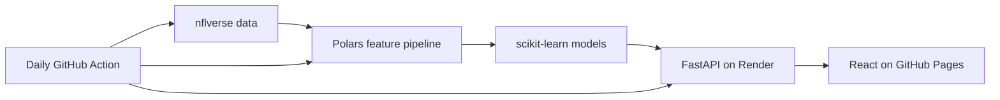

# NFL Game Predictor

An end-to-end machine-learning project that predicts NFL game outcomes and
evaluates custom moneyline, point-spread, and over/under bets. The project
combines historical team and player performance, play-by-play efficiency,
injuries, expected quarterbacks, current rosters, and drafted rookies.

- **Live website:** <https://vihaanbussa.github.io/nflgamepredictor/>
- **API health check:** <https://nflgamepredictor-api.onrender.com/health>
- **Interactive API documentation:** <https://nflgamepredictor-api.onrender.com/docs>

The application is built as a portfolio project and produces experimental
model estimates, not guaranteed outcomes or financial advice.

## How it works



1. `src/collect_nfl_data.py` downloads schedules, weekly team and player
   statistics, play-by-play, injuries, depth charts, rosters, and draft picks
   through the `nflreadpy` package and nflverse datasets.
2. `src/build_features.py` creates leakage-safe features. Every historical
   row uses only information that would have been available before that game.
3. Rolling team form, quarterback form, EPA, success rate, pace, explosive
   plays, red-zone performance, turnovers, injuries, and matchup differences
   are converted into model-ready columns.
4. `src/build_2026_roster.py` and `src/build_expected_starters.py` incorporate
   the current roster, drafted rookies, and expected starting quarterbacks.
5. `src/train.py` compares classification models using chronological
   walk-forward validation. `src/train_score_models.py` separately models
   home score, away score, and the residual from the sportsbook total.
6. The saved models estimate win, cover, and over probabilities. The API also
   compares each probability with the user's American odds to calculate the
   expected return for both sides of a market.
7. The React website lets a user search the upcoming schedule, edit the
   sportsbook lines, and request a prediction from the FastAPI backend.

## Prediction output

For a selected game, the website returns:

- projected home score, away score, and combined total;
- predicted straight-up winner and win probability;
- predicted point-spread side and cover probability;
- predicted over/under side and probability;
- the side with the highest expected value at the entered American odds.

The sportsbook line is an input, not a model prediction. Lines move over time,
so users should enter values from the same sportsbook at roughly the same
time. Expected starters can also change because of injuries or team decisions.

## Tools and technologies

| Area | Tools | Purpose |
|---|---|---|
| Data source | nflverse, `nflreadpy` | NFL schedules, statistics, play-by-play, injuries, rosters, depth charts, and draft picks |
| Data processing | Python, Polars, pandas, NumPy | Cleaning, joining, rolling statistics, and feature engineering |
| Machine learning | scikit-learn, Joblib | Classification, score regression, validation, and saved model artifacts |
| Exploration | Jupyter Notebook, Matplotlib, Seaborn | Data inspection and model experimentation |
| Backend | FastAPI, Uvicorn, Pydantic | Game endpoints, request validation, and model inference |
| Frontend | React, Vite, HTML, CSS | Searchable game form and prediction results |
| Automation | GitHub Actions | Daily data download and upcoming-feature rebuild |
| Hosting | GitHub Pages, Render | Static React hosting and the Python API |
| Earlier prototype | Streamlit | Initial local prediction dashboard |

## Model design

The historical training table covers seasons beginning in 2018. Validation is
chronological rather than randomly shuffled:

- 2022, 2023, and 2024 are used as walk-forward validation seasons;
- candidate models compare full-history and recent-season training windows;
- 2025 is retained as the final chronological test season;
- model candidates include regularized linear/logistic approaches and
  histogram gradient boosting;
- home and away score residuals are used to estimate a score distribution for
  moneyline and total probabilities.

This structure helps reduce look-ahead bias and better represents predicting a
future week from earlier weeks.

## Automatic data updates

The deployed application uses `.github/workflows/update-nfl-data.yml` instead
of writing refreshed files on Render's temporary filesystem.

Every day at approximately 10:17 UTC, GitHub Actions:

1. downloads the newest available NFL datasets;
2. rebuilds rosters, expected starters, historical features, and upcoming-game
   features;
3. commits `data/processed/upcoming_features_2026.parquet` when it changes;
4. triggers Render's automatic redeployment from the updated `main` branch.

Before the 2026 weekly feeds are published, the collector automatically falls
back to completed data through 2025. Once 2026 weekly files become available,
the same workflow begins including them without a configuration change.

The website may display `Data status: disabled`. This only means the
in-process Render refresher is disabled with `NFL_AUTO_REFRESH=0`; scheduled
GitHub updates remain enabled. Free Render services sleep after inactivity, so
the first request can take longer while the API wakes up.

## Run locally

### 1. Install Python packages

```bash
python -m venv .venv
source .venv/bin/activate
pip install -r requirements.txt
```

On Windows PowerShell, activate the environment with:

```powershell
.venv\Scripts\Activate.ps1
```

### 2. Install frontend packages

```bash
cd frontend
npm install
cd ..
```

### 3. Start the API

```bash
source .venv/bin/activate
uvicorn api:app --host 127.0.0.1 --port 8000
```

### 4. Start React in a second terminal

```bash
cd frontend
npm run dev -- --host 127.0.0.1
```

Open <http://127.0.0.1:5173>. The `start_react_app.py` launcher can also start
both processes from one terminal.

## Rebuild data and models

Run the complete pipeline from the project root with the virtual environment
active:

```bash
python -m src.collect_nfl_data
python -m src.build_2026_roster
python -m src.build_expected_starters
python -m src.build_features
python -m src.train
python -m src.train_score_models
python -m src.build_upcoming_features
python -m src.predict
```

The final batch predictions are written under `data/processed/`. The deployed
custom-line API loads `upcoming_features_2026.parquet` and the Joblib artifacts
under `models/`.

## API endpoints

| Method | Endpoint | Description |
|---|---|---|
| `GET` | `/health` | Lightweight Render health check |
| `GET` | `/api/games` | Remaining schedule, expected quarterbacks, and available market lines |
| `POST` | `/api/predict` | Prediction for one game and a custom set of lines |
| `GET` | `/api/refresh-status` | Status of the optional in-process refresher |
| `POST` | `/api/refresh` | Starts a background data refresh in the API process |

## Project structure

```text
.
├── .github/workflows/       # Pages deployment and daily data update
├── data/raw/                # Downloaded source data (ignored by Git)
├── data/processed/          # Engineered datasets and deployed game features
├── frontend/                # React and Vite website
├── models/                  # Trained Joblib model artifacts
├── notebooks/               # Exploration notebook
├── src/                     # Collection, features, training, and prediction
├── api.py                   # FastAPI application
├── app.py                   # Original Streamlit dashboard
├── render.yaml              # Render backend configuration
└── requirements*.txt        # Development and API dependencies
```

## Current limitations and future work

- Predictions depend on the quality and availability of upstream data.
- Expected starting quarterbacks are projections until teams confirm them.
- Sportsbook prices change, and different books can offer different lines.
- The free Render service can have a cold-start delay.
- News sentiment is planned but is not currently part of the live prediction
  pipeline; `src/collect_news.py` is only a placeholder.
- Future seasons will require replacing the hard-coded 2026 target season or
  refactoring it into configuration.
