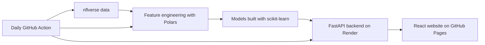

# NFL Game Predictor

I built this project to see how far I could get predicting NFL games with more
than just a team's win-loss record. It uses recent team and quarterback stats,
play-by-play efficiency, injuries, rosters, drafted rookies, and sportsbook
lines to predict an upcoming game.

The website gives predictions for the outright winner, the point spread, and
the over/under. You can also enter your own American odds, and it will estimate
which side has the better expected value.

- **Try the website:** <https://vihaanbussa.github.io/nflgamepredictor/>
- **API health check:** <https://nflgamepredictor-api.onrender.com/health>
- **API documentation:** <https://nflgamepredictor-api.onrender.com/docs>

This is an experimental portfolio project, not a guarantee or betting advice.

## The basic idea



The project works in a few stages:

1. I download schedules, team stats, player stats, play-by-play, injuries,
   depth charts, rosters, and draft picks from nflverse with `nflreadpy`.
2. I turn the raw data into one row per game. Each row describes what was known
   about the two teams before that game was played.
3. I train separate models for winning, covering the spread, game totals, home
   score, and away score.
4. For an upcoming game, the backend loads the newest features and runs them
   through the saved models.
5. The React site sends the game and the user's lines to the backend, then
   displays the probabilities and expected value.

## How I trained the models

I started by building a historical dataset with completed games from 2018
through 2025. One of the most important parts was avoiding data leakage. For
example, a Week 8 training row is allowed to use a team's performance through
Week 7, but it cannot use anything from Week 8 or later.

Most of the recent-form features use a rolling five-game window. Some examples
are:

- passing and rushing yards;
- EPA per play and success rate;
- early-down efficiency and neutral-situation pass rate;
- explosive-play and touchdown rates;
- red-zone and scoring-drive performance;
- turnovers, sacks, penalties, pace, and rest;
- points scored, points allowed, and recent win rate;
- quarterback EPA, yards per attempt, completion percentage over expected,
  and interception rate;
- injury burden and the number of players listed as out or questionable;
- Elo difference, weather, home-field context, and sportsbook lines;
- roster and draft features, including early draft picks and rookie QBs.

For moneyline and spread predictions, I mainly use the difference between the
home and away teams. For totals, I mainly use the sum of both teams' offensive
and defensive features. That makes the inputs match the question each model is
trying to answer.

### Training targets

I trained the classification models on three different yes-or-no targets:

- `home_win`: did the home team win the game?
- `home_cover`: did the home team cover the closing spread?
- `over_hit`: did the final combined score go over the closing total?

I also trained regression models for `home_score`, `away_score`, and
`total_residual`. The total residual is the difference between the actual game
total and the sportsbook's total line.

### Why I did not randomly split the games

A random train/test split would let future seasons influence predictions for
older seasons. That is not how real weekly predictions work, so I used
walk-forward validation instead:

- to validate 2022, the model trains only on seasons before 2022;
- to validate 2023, it trains only on seasons before 2023;
- to validate 2024, it trains only on seasons before 2024;
- I average those results to choose a model;
- I leave 2025 untouched until the final evaluation.

For classification, I rank candidates mainly by log loss because I care about
the quality of the predicted probabilities, not only whether a 50% cutoff was
correct. I also print accuracy, Brier score, and ROC-AUC. For score regression,
I compare mean absolute error and root mean squared error.

I tested regularized logistic regression and histogram gradient boosting with
different settings. I also compared models trained on all prior seasons with
models trained on only the most recent three or five seasons. The current saved
artifacts selected:

| Prediction | Selected candidate |
|---|---|
| Moneyline | Histogram gradient boosting using all prior seasons |
| Spread | Strongly regularized logistic regression using the recent 3-season window |
| Over/under classification | Strongly regularized logistic regression using all prior seasons |
| Home score | Small gradient-boosted regressor using the recent 5-season window |
| Away score | Small gradient-boosted regressor using the recent 5-season window |
| Total residual | Small gradient-boosted regressor using all prior seasons |

After choosing each candidate, I retrain it on every allowed game through 2024
and evaluate it once on 2025. The final fitted pipelines and their exact feature
lists are saved as Joblib files under `models/`.

The home and away score errors are related, so I also save their residual
covariance. The API uses that error distribution to turn a projected score
margin into a win probability. It uses the total model's residual error in a
similar way to estimate the probability of going over or under a custom line.

## What the website returns

For one selected game, the website shows:

- a projected score for both teams;
- the predicted winner and win probability;
- the predicted spread side and cover probability;
- the predicted over or under and its probability;
- the side with the best expected value at the odds entered by the user.

The sportsbook lines are inputs, not predictions made by the model. Since lines
move, it is best to enter all the numbers from the same sportsbook at around the
same time. Starting quarterbacks can change too, especially when injuries or
training-camp competitions are involved.

## What I used to build it

| Part of the project | Tools I used |
|---|---|
| NFL data | nflverse and `nflreadpy` |
| Data cleaning and features | Python, Polars, pandas, and NumPy |
| Models | scikit-learn and Joblib |
| Exploration | Jupyter Notebook, Matplotlib, and Seaborn |
| Backend API | FastAPI, Pydantic, and Uvicorn |
| Website | React, Vite, HTML, and CSS |
| Automatic updates | GitHub Actions |
| Hosting | GitHub Pages for React and Render for FastAPI |
| First prototype | Streamlit |

## How the data stays updated

Render's free filesystem is temporary, so I do not rely on the running API to
save new data. Instead, `.github/workflows/update-nfl-data.yml` runs once a day
at about 10:17 UTC.

The workflow downloads the latest available data, rebuilds the roster and game
features, and commits `upcoming_features_2026.parquet` if it changed. Render
then notices the new commit and redeploys the API with the updated file.

Before 2026 weekly stats are published, the collector falls back to completed
data through 2025. Once the new weekly feeds become available, the exact same
workflow will start using them automatically.

The site may say `Data status: disabled`. That only refers to the refresh
process inside Render. The scheduled GitHub Action is still enabled and is the
part that keeps the deployed data current. Also, Render's free service sleeps
when nobody uses it, so the first request may take a little longer.

## Running the project locally

### Install the Python packages

```bash
python -m venv .venv
source .venv/bin/activate
pip install -r requirements.txt
```

On Windows PowerShell, activate the environment with:

```powershell
.venv\Scripts\Activate.ps1
```

### Install the React packages

```bash
cd frontend
npm install
cd ..
```

### Start the backend

```bash
source .venv/bin/activate
uvicorn api:app --host 127.0.0.1 --port 8000
```

### Start React in a second terminal

```bash
cd frontend
npm run dev -- --host 127.0.0.1
```

Then open <http://127.0.0.1:5173>. `start_react_app.py` can also start both
processes from one terminal.

## Rebuilding everything

To download the data, rebuild the features, retrain the models, and generate a
new prediction file, run:

```bash
python -m src.collect_nfl_data
python -m src.build_2026_roster
python -m src.build_expected_starters
python -m src.build_features
python -m src.train
python -m src.train_score_models
python -m src.build_upcoming_features
python -m src.predict
```

The batch prediction files go into `data/processed/`. The live API uses
`upcoming_features_2026.parquet` together with the trained artifacts in
`models/`.

## API endpoints

| Method | Endpoint | What it does |
|---|---|---|
| `GET` | `/health` | Checks whether the Render API is awake |
| `GET` | `/api/games` | Returns the upcoming schedule, expected QBs, and available lines |
| `POST` | `/api/predict` | Runs one game through the models with custom lines |
| `GET` | `/api/refresh-status` | Returns the optional in-process refresh status |
| `POST` | `/api/refresh` | Starts a background refresh inside the API process |

## Project structure

```text
.
├── .github/workflows/       # Website deployment and daily data update
├── data/raw/                # Downloaded data, ignored by Git
├── data/processed/          # Feature tables and upcoming-game data
├── frontend/                # React website
├── models/                  # Saved scikit-learn models
├── notebooks/               # My exploration notebook
├── src/                     # Data, training, and prediction scripts
├── api.py                   # FastAPI backend
├── app.py                   # Original Streamlit version
├── render.yaml              # Render setup
└── requirements*.txt        # Python dependencies
```

## Things I would still like to improve

- The model can only be as good as the available injury, roster, and stat data.
- Expected QBs are still projections until a team confirms its starter.
- Different sportsbooks may have different lines and payouts.
- The free Render server has a cold-start delay.
- I started a news collector, but sentiment is not part of the live model yet.
  `src/collect_news.py` is currently just a placeholder.
- The target season is still hard-coded as 2026. A future version should make
  the season a configuration value.
